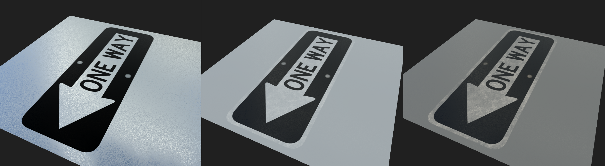

# RoadSignsMarkings
Procedural road signs and lane markings

**Examples of Road Sign Textures**

**Stop**

Adjusting the parameters of **dirt level** on the Stop texture; from left to right: 0, 0.5, 1

**One Way**

Adjusting the parameters of **dirt level** on the One Way texture; from left to right: 0, 0.5, 1

**Speed Limit**

Adjusting the parameters of **dirt level** on the Speed Limit texture; from left to right: 0, 0.5, 1

Adjusting the parameters of **MPH text** on the Speed Limit texture; from left to right: 15, 30, 60

**Yield**

Adjusting the parameters of “dirt level” on the Yield texture; from left to right: 0, 0.5, 1	

**Do Not Enter**
	
	
	
Adjusting the parameters of **dirt level** on the Do Not Enter texture; from left to right: 0, 0.5, 1

**Pedestrian Crossing**

Adjusting the parameters of **dirt level** on the Pedestrian texture; from left to right: 0, 0.5, 1

**No Left/Right Turn**

Adjusting the parameters of **dirt level** on the No Left-Right Turn texture; from left to right: 0, 0.5, 1

Adjusting the parameters of **Horizontal Mirror** on the No Left-Right Turn texture

**Examples of Road Textures**

**Road Base**

Adjusting the parameters of **dirt level** on the Road Base texture; from left to right: 0, 0.5, 1

Adjusting the parameters of **Crack Intensity** on the Road Base texture; from left to right: 0, 0.5, 1

Adjusting the parameters of **Crack Size** on the Road Base texture; from left to right: 4x, 2x, 1x, 1/2x, 1/4x

**Sidewalk**

Adjusting the parameters of **dirt level** on the Sidewalk texture; from left to right: 0, 0.5, 1

**Lane Markings**

Adjusting the arrow direction on the Lane markings Turn Signals Template texture; from left to right: Left, Right, Left-Straight, Right-Straight

Adjusting the parameters of **Lane Size** on the Pedestrian Crossing texture; from left to right: 1x, 1/2x

Example of Stop Ahead Lane Marking texture

Example of Lane Markings - White texture

Example of Lane Markings - Double Yellow texture

